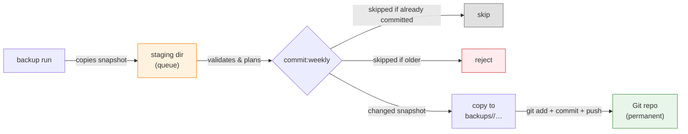

# Supabase DB (free) backup

Encrypted logical backups of the **development** and **production** Fragtrack
Supabase databases, stored in Cloudflare R2 (7-day rolling window) and in this
Git repository (permanent, dated), with verified restore commands for hosted
targets (restore sources: R2, Git repository, or the private local store).

> This backs up the _databases_, not the whole Supabase project: no Storage
> object bytes, Edge Functions, dashboard/Auth provider settings, API keys, or
> the Vault root key. See [Backup scope](#backup-scope).

---

## Rationale

Supabase **free tier** plan does not offer a backup solution. This repo tries to solve that problem,
by storing daily (for the last week) db snapshots in Cloudflare R2 and a weekly snapshot in this repo.

## Prerequisites

- **Node.js >= the release pinned in `.node-version`** (the preflight rejects older versions; npm `12.0.2`);
- **age** ([used for encryption](https://github.com/FiloSottile/age));
- **Docker** (Having Supabase installed from a docker image suffices);
- **`gh`** (**optional** - only for `github:configure` script).

## Usage

1. Clone the repository and make it private (otherwise the job will fail).
2. Create the `.env.production.local` and (if needed) `.env.development.local` files - only the _production_ one is mandatory.
   Check [configuration](#configuration).

## Architecture

Every day at **03:17 UTC** (GitHub Actions, `.github/workflows/backup.yml`):

```mermaid
flowchart TD
    A["Hosted DBs\n(development, production)"] -->|daily logical dump\n(roles, custom schema, auth/storage deltas,\nmigration history, row data)| B
    B{"normalize + fingerprint"}
    B -->|same as newest R2 snapshot| C["nothing uploaded"]
    B -->|changed| D["age-encrypt row data\n(per-env identity), split into 90 MiB parts"]
    D --> E["R2 bucket per environment"]
    E -->|"7-day retention, always keeps newest valid\nsnapshot (unchanged DB never loses its copy)"| E
    E --> F["Sunday: commit snapshot\ninto backups/<env>/…\nin this repo (append-only)"]
    style C fill:#e0e0e0,stroke:#666
    style E fill:#e3f2fd,stroke:#1976d2
    style F fill:#e8f5e9,stroke:#388e3c
```

- **The dump is the change detector**: a dump is taken every day; unchanged
  databases upload nothing but retention still runs.
- At most **one completed snapshot per UTC date** per environment; a changed
  same-day snapshot replaces the previous one.
- Git snapshots are permanent and append-only; R2 is the fast/rolling copy,
  Git is the recovery of last resort.

## Core implementation

| Module (`src/`)                                      | Responsibility                                                                                                                                                                            |
| ---------------------------------------------------- | ----------------------------------------------------------------------------------------------------------------------------------------------------------------------------------------- |
| `config.js`                                          | dotenv + process env loading, validation (session-pooler URL, bucket/env match)                                                                                                           |
| `database.js`                                        | Pinned Supabase CLI dump/diff, `supabase db reset` execution                                                                                                                              |
| `backup.js`                                          | Shared dump/package mechanics: executable preflight, private workspace, dump-then-package                                                                                                 |
| `snapshot.js`                                        | Snapshot packaging (encrypted or plaintext row-data codec) and the `manifest.json` written last (marks completion)                                                                        |
| `encryption.js`                                      | Row-data codecs: age (X25519) encryption of gzipped row data or plaintext, 90 MiB part splitting                                                                                          |
| `fingerprint.js`                                     | Deterministic hash over normalized logical SQL (the change detector)                                                                                                                      |
| `r2.js`                                              | S3 upload/list/delete against the per-environment R2 bucket                                                                                                                               |
| `repository.js`                                      | Reading/writing dated snapshot dirs in Git                                                                                                                                                |
| `restore.js`                                         | Shared verification: manifest schema, sizes, SHA-256, part order, codec-aware row-data restore (decryption only for age snapshots), aggregate fingerprint; sources: repo, R2, local store |
| `hosted-restore.js`                                  | Hosted restore: Dockerized psql client (pinned ephemeral image), reset target, apply verified snapshot in one transaction                                                                 |
| `local-stack.js`                                     | Read-only local-stack helpers: Fragtrack workdir parsing/validation and the psql probe used by `backup:local`                                                                             |
| `local-backup.js`                                    | Local store: private tree/lock, read-only stability guard, crash-durable publish-before-retention                                                                                         |
| `runtime.js`, `stream.js`, `process.js`, `logger.js` | Node runtime gate, streaming, subprocess, logging utilities                                                                                                                               |

## Backup scope

**Included:** custom roles (no passwords), application schema, custom
`auth`/`storage` changes (e.g. the `create_account_for_new_user` and
`cleanup_deleted_user_vouches` triggers, restored as a managed delta),
migration history, supported row data (incl. Auth/Storage metadata).

**Excluded:** Storage object bytes, Edge Functions, dashboard/Auth provider
settings and API keys, Vault/pgsodium root key, `storage.buckets_vectors` /
`storage.vector_indexes`, Realtime configuration outside captured SQL.

## Snapshot layout

```text
R2 bucket (development|production):
  snapshots/<YYYY-MM-DDTHH-mm-ssZ>/
    roles.sql,
    schema.sql,
    managed-schema.sql,
    migration-history-schema.sql
    data.sql.gz.age.part-000 …            # encrypted, ≤90 MiB parts
    manifest.json                         # sizes/SHA-256, env, project ref,
                                          # CLI+Postgres versions, age recipient,
                                          # aggregate content fingerprint

Git repository (backups/<environment>/):
  backups/<environment>/<YYYY-MM-DDTHH-mm-ssZ>/   # same files as above,
                                                  # no snapshots/ level
```

## Configuration

Ignored local files (never commit):

- `.env.development.local`,
- `.env.production.local`.

Variables (see [.env.example](.env.example)):

| Variable                                    | Purpose                                     | Notes                                                                                                                        |
| ------------------------------------------- | ------------------------------------------- | ---------------------------------------------------------------------------------------------------------------------------- |
| `BACKUP_ENVIRONMENT`                        | `development` \| `production`               | must match target (development for env.development.local & production from env.production.local)                             |
| `SUPABASE_PROJECT_REF`                      | supabase project reference                  | the unique 20-character identifier for your Supabase project, shown as the last part of your dashboard URL (after /project/) |
| `SUPABASE_DB_URL`                           | **session-pooler or matching direct**       | postgres://<USER>:<PASSWORD>@<HOST>:<PORT>/<DATABASE>?sslmode=require                                                        |
| `CLOUDFLARE_ACCOUNT_ID`                     | Cloudflare account id                       |                                                                                                                              |
| `R2_BUCKET`                                 | R2 bucket                                   | must equal the environment (production \| development)                                                                       |
| `R2_ACCESS_KEY_ID` / `R2_SECRET_ACCESS_KEY` | R2 credentials (scoped to the bucket)       |                                                                                                                              |
| `ENCRYPT_KEY`                               | public age recipient (`age1…`)              | backup only (hosted); not consumed by `backup:local` or `restore:* --source local`                                           |
| `DECRYPT_KEY`                               | private age identity (`AGE-SECRET-KEY-…`)   | r2/repo restores only (and legacy encrypted local snapshots); never uploaded                                                 |
| `PROJECT_WORKDIR`                           | path to sibling project where supabase runs | used for local restore; `backup:local` dump source                                                                           |
|                                             |                                             |                                                                                                                              |

To generate `ENCRYPT_KEY` and `DECRYPT_KEY` run `npm run generate-age-keys` to populate these fields.

To set these variables automatically instead of
`npm run github:configure [OWNER/REPO]` validates both local files and syncs
both GitHub Environments (creates absent ones, upserts only the approved
variables/secrets above; never deletes remote config;
`DECRYPT_KEY` and other keys are never uploaded).
Target repository must be private and `gh` authenticated. Reruns are safe and idempotent.

## Scripts

All commands can be run with `npm run`.
Arguments pass through directly — no `--` separator (`npm run backup -- --environment development`).

**Quality gates** (no Docker/network/secrets required except
`test:integration`):

| Script                     | Runs                                                               | Purpose                                                                              |
| -------------------------- | ------------------------------------------------------------------ | ------------------------------------------------------------------------------------ |
| `npm run lint`             | `vp lint`                                                          | Oxlint with the migrated ESLint policy (`vite.config.ts` `lint.rules`)               |
| `npm run test`             | `node --test --test-skip-pattern=integration`                      | Native unit tests                                                                    |
| `npm run test:integration` | `node --test --test-name-pattern=integration --test-concurrency=1` | Serial Docker integration suite on disposable fixtures                               |
| `npm run check`            | `vp check` + unit tests                                            | Full package check. Note: bare `vp check` is only formatting + lint (Vite+ built-in) |
| `npm run preflight`        | `node --input-type=module -e "…assertNodeVersion()"`               | Runtime version gate (`.node-version` minimum)                                       |

**Formatting and environment:**

| Command             | Runs            | Purpose                                     |
| ------------------- | --------------- | ------------------------------------------- |
| `npm run fmt`       | Oxfmt           | Auto-format all files in the working tree   |
| `npm run fmt:check` | Oxfmt (dry-run) | Fail if any file is unformatted; used in CI |

**Backup and restore:**

| Script                                                                                                            | Purpose                                                                         |
| ----------------------------------------------------------------------------------------------------------------- | ------------------------------------------------------------------------------- |
| `npm run backup -- --environment development\|production`                                                         | Dump, fingerprint, upload changed snapshot to R2, run retention                 |
| `npm run backup:local -- --environment development\|production`                                                   | Package the ALREADY-RUNNING local Fragtrack DB into `local-backups/<env>/`      |
| `npm run restore:development -- --source r2\|repo\|local --backup latest\|<snapshot-id>`                          | Restore into hosted development DB                                              |
| `npm run restore:production -- --source r2\|repo\|local --backup latest\|<snapshot-id>`                           | Restore into hosted production DB (maintenance window required)                 |
| `npm run restore:local -- --environment development\|production --source r2\|repo --backup latest\|<snapshot-id>` | Restore either hosted snapshot into the local `../fragtrack` stack              |
| `npm run github:configure [OWNER/REPO]`                                                                           | Validate local env files, sync GitHub Environments                              |
| `npm run generate-age-keys`                                                                                       | Generate age X25519 key pair and write to existing `.env.*.local` files         |
| `npm run commit:weekly -- --staging-dir <path> --repo-root .`                                                     | Weekly Git snapshot commit (used by the workflow; runnable locally on `master`) |

- Restore targets are **cleaned first** (`supabase db reset` / volume
  recreation), then the verified snapshot applies in **one Dockerized psql
  transaction** streamed over stdin (`ON_ERROR_STOP=1`, `--single-transaction`)
  from the pinned ephemeral image; on failure the target rolls back and stays
  clean — retry from the same verified snapshot. The client container uses
  default bridge networking (no `--network=host`), keeps a read-only rootfs
  with a writable in-memory `/tmp`, and complete stdin delivery is part of
  command success: a source read failure terminates the client instead of
  letting a partial SQL prefix commit and be reported as restored.
- `--backup` accepts `latest` or one exact canonical snapshot id
  (`YYYY-MM-DDTHH-mm-ssZ`); unavailable ids print the valid choices.
- Before any repo restore: `git pull --ff-only origin master`.
- Confirmation phrases (interactive TTY, no bypass): hosted development
  `RESTORE development`; hosted production `RESTORE production <project-ref>`.
- Local restore into the local stack is removed; the local store only feeds
  hosted restores (`--source local`).

### Staging directory (`--staging-dir`)

The **staging directory is a queue, not a backup**: it holds snapshots that
are _pending_ the next weekly Git commit, before they are accepted into the
append-only `backups/<environment>/<snapshot-id>/` history. It is unrelated to
Git's index (nothing here is ever `git add`ed directly) and its contents are
ephemeral — the durable copies are R2 and the committed `backups/` tree.

```text
<staging-dir>/<environment>/<snapshot-id>/
  roles.sql, schema.sql, …, data.sql.gz.age.part-000, manifest.json
```



### Local backup (`backup:local`)

`npm run backup:local -- --environment <development|production>` packages the
**already-running local Supabase stack** owned by the sibling Fragtrack project
into a private, repository-local store. It reuses the exact dump, fingerprint,
gzip + plaintext part splitting, and manifest pipeline as the hosted backup,
but never encrypts (no age binary, no `ENCRYPT_KEY`), never touches R2, and
never starts, stops, resets, or migrates the local stack. It uses only
read-only connectivity and source-state probes. The selected environment only
selects **target metadata** (`SUPABASE_PROJECT_REF`); the data source is always
the local database.

```text
local-backups/local/<YYYY-MM-DDTHH-mm-ssZ>/
  roles.sql
  schema.sql
  managed-schema.sql
  migration-history-schema.sql
  data.sql.gz.part-000 …      # plaintext (local-only) gzip parts, ≤90 MiB
  manifest.json               # written last; completion marker, declares
                              #   "encryption": { "format": "none" }
```

- One completed snapshot is retained in the single `local` store; there is no
  per-environment isolation because there is one local database.
- Existing snapshots under `local-backups/development/` and
  `local-backups/production/` from the pre-single-store layout are NOT
  deleted but are no longer restorable; reconcile/remove them manually.
- The six sequential logical dumps are bracketed by conservative, database-local
  state probes (tuple-mutation counters plus relation, sequence, and role digests).
  Any data, schema, role, or sequence change rejects the candidate before packaging
  or publication; quiesce local writes and retry.
- An **unchanged** database keeps the existing snapshot ID and path (same
  logical content and target project ref). A **changed** snapshot is fully
  validated, its files/directories are fsynced, and it is atomically renamed
  and parent-fsynced before older snapshots are removed. Retention is
  parent-fsynced again; unsupported fsync semantics fail closed before old
  snapshots are deleted. Completed snapshots are never overwritten.
- On POSIX, existing store/snapshot directories must already be mode `0700`
  and retained files mode `0600`. Every retained file is allowlisted by the
  manifest and size/SHA-256
  verified; plaintext row-data intermediates never survive the run.
- Do not commit `local-backups/` (gitignored). At rest, local snapshots are
  PLAINTEXT on disk (gzip row data only) — the tradeoff is deliberate: no
  age on this path. Confidentiality relies on the 0700 directory / 0600 file
  policy (POSIX) and the gitignore; a machine with read access to the repo
  dir can read local snapshots. The store is restorable via
  `restore:development|production --source local` (see below) and ready for a
  later, separately authorized upload flow — no upload command exists here.
- **Stale-lock recovery:** if a run is interrupted, the store lock
  `local-backups/.lock-local` may remain. Confirm no matching
  `backup:local` command is active, then remove the lock file and retry. Lock
  release verifies its ownership token/inode and reports cleanup failures.
  Interrupted canonical `.candidate-<16-hex>` directories are cleaned on the
  next run; noncanonical lookalikes are preserved for manual reconciliation.

### Restore a local backup to a hosted environment

`npm run restore:development|restore:production -- --source local --backup
latest|<snapshot-id>` restores a snapshot from `local-backups/<target-env>/`
into the hosted target database. Plaintext snapshots need **no decryption**:
no `DECRYPT_KEY`, no age binary, no R2 credentials. `DECRYPT_KEY` is
**optional** for `--source local` — it is only resolved when actually
configured (and then conflict-checked like any other consumed variable). A
pre-refactor age-encrypted snapshot still found in the store keeps working
when `DECRYPT_KEY` and the age binary are configured; if the age binary is
missing from PATH while `DECRYPT_KEY` is set, the restore fails fast during
preflight with the install hint. Hosted read-only preflight,
reset/apply pipeline, and confirmation phrases are unchanged (production still
requires `RESTORE production <project-ref>`).

## References

- [Supabase automated backups (CLI)](https://supabase.com/docs/guides/backups/automated-backups)
- [Supabase CLI backup/restore guide](https://supabase.com/docs/guides/cli/managing-config)
- [Supabase local development backups](https://supabase.com/docs/guides/local-development/cli/local-backups)
- [Cloudflare R2 S3 JavaScript SDK](https://developers.cloudflare.com/r2/examples/aws-sdk-js-v3/)
- [GitHub Actions — Scheduled workflows](https://docs.github.com/en/actions/reference/events-that-trigger-workflows#schedule)
- [age encryption format](https://age-encryption.org/)
