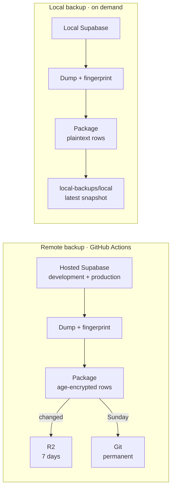
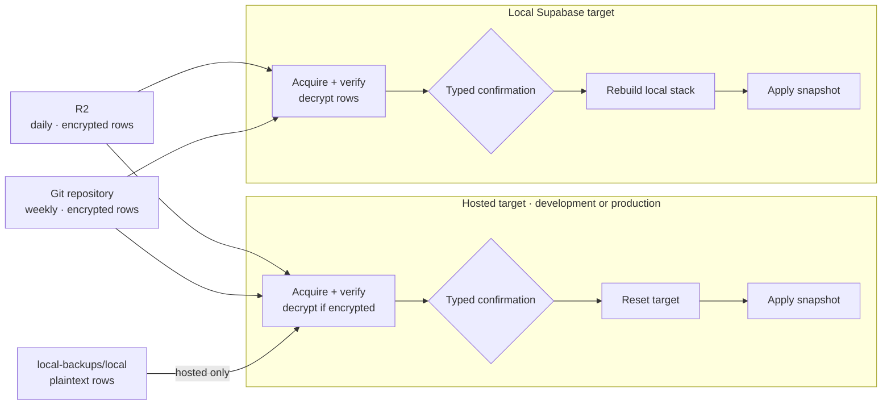

# Supabase DB (free) backup

Logical backups of the **development** and **production** Supabase databases,
with age-encrypted row data, stored in Cloudflare R2 (seven-day rolling window,
always retaining the newest valid snapshot) and in this Git repository
(permanent, dated), with verified restore commands.

> This backs up the _databases_, not the whole Supabase project: no Storage
> object bytes, Edge Functions, dashboard/Auth provider settings, API keys, or
> the Vault root key. See [Backup scope](#backup-scope).

---

## Rationale

Supabase's **Free Plan** does not include managed database backups. This
repository runs daily backups, stores changed snapshots in Cloudflare R2 for
seven days (always retaining the newest valid snapshot), and commits snapshots
to this repository weekly.

## Prerequisites

- **Node.js >= the release pinned in `.node-version`** (the preflight rejects older versions);
- **age** ([used for encryption](https://github.com/FiloSottile/age));
- **Docker Engine and CLI**;
- **`gh`** (required by `github:configure`; optional when GitHub is configured manually).

## Usage

### Setup

1. Create a separate private GitHub repository from this source.
   **Note:** A public fork remains public and cannot run backups.
2. Create `.env.production.local` and `.env.development.local`; both are
   required for the scheduled two-environment workflow. See
   [Configuration](#configuration).
3. Run `npm run doctor` to validate the `.env.*.local` files.
4. Run `npm run github:configure` (or
   `npm run github:configure -- OWNER/REPO`) to upload only the approved GitHub
   Actions variables and secrets. It never uploads `DECRYPT_KEY`.

   Scheduled backups are enabled after this command succeeds.

### Manual Backup

See [Backup](#backup).

### Restore

See [Restore](#restore).

## Architecture

### Backup flow

Remote backups run daily at **03:17 UTC** when the private repository has
`BACKUPS_ENABLED=true`. Local backups run on demand with `npm run backup:local`.



### Restore flow

R2 and Git snapshots can restore to hosted or local targets. Plaintext local
snapshots can restore only to hosted targets. Every snapshot is verified before
confirmation and any target is changed.



## Backup scope

**Included:** custom roles (no passwords), application schema, custom
`auth`/`storage` changes (e.g. the `create_account_for_new_user` and
`cleanup_deleted_user_vouches` triggers, restored as a managed delta),
migration history, supported row data (incl. Auth/Storage metadata).

**Excluded:** Storage object bytes, Edge Functions, dashboard/Auth provider
settings and API keys, Vault/pgsodium root key, `storage.buckets_vectors` /
`storage.vector_indexes`, Realtime configuration outside captured SQL.

## Snapshot layout

```text
R2 bucket (development|production):
  snapshots/<YYYY-MM-DDTHH-mm-ssZ>/
    roles.sql
    schema.sql
    managed-schema.sql
    migration-history-schema.sql
    data.sql.gz.age.part-000 …            # encrypted, ≤90 MiB parts
    manifest.json                         # sizes/SHA-256, env, project ref,
                                          # CLI+Postgres versions, age recipient,
                                          # aggregate content fingerprint

Git repository (backups/<environment>/):
  backups/<environment>/<YYYY-MM-DDTHH-mm-ssZ>/   # same files as above,
                                                  # no intermediate snapshots/ directory
```


## Configuration

Create ignored local files (never commit):

- `.env.development.local`,
- `.env.production.local`.

Configuration values (see [.env.example](.env.example)):

| Variable                                    | Notes                                                                                                                                                                                            |
|---------------------------------------------|--------------------------------------------------------------------------------------------------------------------------------------------------------------------------------------------------|
| `BACKUPS_ENABLED`                           | repository-level Actions variable; must be set to exactly `true`                                                                                                                                      |
| `BACKUP_ENVIRONMENT`                        | must match the target (`development` for `.env.development.local`; `production` for `.env.production.local`)                                                                                          |
| `SUPABASE_PROJECT_REF`                      | the unique 20-character identifier for your Supabase project, shown as the last part of your dashboard URL (after `/project/`)                                                                        |
| `SUPABASE_SHARED_POOLER_URL`                | copy the Session pooler value from Dashboard > Connect > Session pooler (`postgresql://postgres.<project-ref>:<password>@aws-<pool>-<region>.pooler.supabase.com:5432/postgres?sslmode=require`)     |
| `CLOUDFLARE_ACCOUNT_ID`                     | 32-character hexadecimal account ID                                                                                                                                                                   |
| `R2_BUCKET`                                 | must equal the environment (`production` \| `development`)                                                                                                                                            |
| `R2_ACCESS_KEY_ID` / `R2_SECRET_ACCESS_KEY` | R2 access key ID and secret access key; scope the credentials as narrowly as possible                                                                                                                  |
| `ENCRYPT_KEY`                               | public age recipient used to encrypt hosted row data; generated with `npm run generate-age-keys`; not consumed by restore or local commands                                                           |
| `DECRYPT_KEY`                               | private age identity used to decrypt row data for `r2`/`repo` restores and legacy encrypted local snapshots; generated with `npm run generate-age-keys`; never uploaded                                |
| `SUPABASE_CONFIG_PATH`                      | absolute path, or path relative to this repository, to the main project's `supabase/config.toml`; required by `doctor`, `backup:local`, `reset:local`, and the target side of `restore:local`           |

To generate `ENCRYPT_KEY` and `DECRYPT_KEY`, run `npm run generate-age-keys`
once to populate both fields in every existing `.env.*.local` file.


## Scripts

| Script                     | Purpose                                                                                |
|----------------------------|----------------------------------------------------------------------------------------|
| `npm run lint`             | runs Oxlint with the migrated ESLint policy (`lint.rules` in `vite.config.ts`) |
| `npm run test`             | runs unit tests                                                          |
| `npm run test:integration` | runs the serial Docker integration suite on disposable fixtures          |
| `npm run check`            | runs format, lint, type checks, and unit tests                            |
| `npm run preflight`        | checks the running Node.js version against `.node-version`                |
| `npm run fmt`              | formats code                                                              |
| `npm run fmt:check`        | checks code formatting without modifying files                            |


**Backup, restore, and reset:**

| Script                                                                                                            | Purpose                                                                                     |
|-------------------------------------------------------------------------------------------------------------------|---------------------------------------------------------------------------------------------|
| `npm run backup -- --environment development\|production`                                                         | backup & upload changed snapshot to R2, run retention                                       |
| `npm run backup:local`                                                                                            | backup db from local project (`SUPABASE_CONFIG_PATH`) into `local-backups/local/`            |
| `npm run restore:development -- --source r2\|repo\|local --backup latest\|<snapshot-id>`                          | restore into hosted development DB                                                          |
| `npm run restore:production -- --source r2\|repo\|local --backup latest\|<snapshot-id>`                           | restore into hosted production DB (maintenance window required)                             |
| `npm run restore:local -- --environment development\|production --source r2\|repo --backup latest\|<snapshot-id>` | restore a hosted snapshot into the local DB                                                 |
| `npm run reset:development`                                                                                       | reset hosted development DB to empty; requires `RESET development`                          |
| `npm run reset:production`                                                                                        | reset hosted production DB to empty; requires `RESET production <project-ref>`              |
| `npm run reset:local`                                                                                             | rebuild the local DB from the configured project's migrations and seed; no confirmation     |
| `npm run doctor`                                                                                                  | validate every existing dotenv file (private permissions, static contract, and read-only hosted DB/R2/age/local-stack probes)                                   |
| `npm run github:configure [-- OWNER/REPO]`                                                                        | run the doctor in static-only mode, then sync allowlisted values from the local `.env.*.local` files to GitHub Environments                                     |
| `npm run generate-age-keys`                                                                                       | generate an age X25519 key pair and write it to existing `.env.*.local` files                                                                                    |
| `npm run commit:weekly -- --staging-dir <path> --repo-root .`                                                     | Weekly Git snapshot commit (used by the workflow; runnable locally on `master`)                                                                                  |


## Backup

### Local

Back up the already-running local Supabase database configured by
`SUPABASE_CONFIG_PATH` in `.env.development.local`:

```sh
npm run backup:local
```

This keeps one plaintext snapshot in `local-backups/local/`.
You can restore this snapshot to hosted development or production.

### Remote

Back up a hosted database to R2 with age-encrypted row data:

```sh
npm run backup -- --environment development
npm run backup -- --environment production
```

No snapshot is uploaded when the database is unchanged. R2 snapshots older
than seven days are removed, except that the newest valid snapshot is always
retained.

## Restore

> **Warning:** Restores are destructive: they clear the target database before
> applying the snapshot.

Hosted restores accept `r2` (daily), `repo` (weekly), or `local`
(`local-backups/local/`). `restore:local` accepts only `r2` or `repo`.
`--backup` accepts `latest` or an exact `YYYY-MM-DDTHH-mm-ssZ` snapshot ID.

### Local

Restore a hosted snapshot from R2 or this repository into the local Supabase
stack configured by `SUPABASE_CONFIG_PATH` in `.env.development.local`.
`--environment` selects the snapshot source, not the target:

```sh
# Latest development snapshot from R2
npm run restore:local -- --environment development --source r2 --backup latest

# Specific production snapshot committed to this repository
npm run restore:local -- --environment production --source repo --backup 2026-08-24T03-17-09Z
```

### Remote

Restore a snapshot into the hosted database selected by the script name:

```sh
# Latest R2 snapshot into development
npm run restore:development -- --source r2 --backup latest

# Latest R2 snapshot into production
npm run restore:production -- --source r2 --backup latest

# Latest local backup into development
npm run restore:development -- --source local --backup latest

# Specific committed snapshot into production
git pull --ff-only origin master
npm run restore:production -- --source repo --backup 2026-08-24T03-17-09Z
```

## Reset

Reset deletes current data and does not restore a backup.

### Local

Rebuild the already-running local database from the migrations and seed of the
project selected by `SUPABASE_CONFIG_PATH` in `.env.development.local`:

```sh
npm run reset:local
```

### Remote

Reset a hosted database to empty. The script name fixes the target environment:

```sh
npm run reset:development
npm run reset:production
```

## References

- [Supabase automated backups (CLI)](https://supabase.com/docs/guides/backups/automated-backups)
- [Supabase CLI backup/restore guide](https://supabase.com/docs/guides/cli/managing-config)
- [Supabase local development backups](https://supabase.com/docs/guides/local-development/cli/local-backups)
- [Supabase — connecting to PostgreSQL (Session pooler)](https://supabase.com/docs/guides/database/connecting-to-postgres)
- [Cloudflare R2 S3 JavaScript SDK](https://developers.cloudflare.com/r2/examples/aws-sdk-js-v3/)
- [GitHub Actions — Scheduled workflows](https://docs.github.com/en/actions/reference/events-that-trigger-workflows#schedule)
- [GitHub CLI — `gh secret delete`](https://cli.github.com/manual/gh_secret_delete)
- [age encryption format](https://age-encryption.org/)
