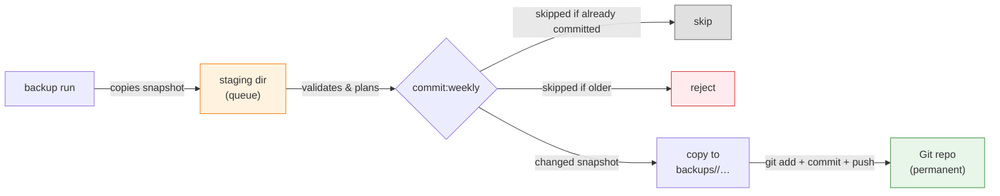

# Supabase database backup and restore

Encrypted logical backups of the **development** and **production** Supabase
databases, stored in Cloudflare R2 (7-day rolling window) and in this Git
repository (permanent, dated), with verified restore commands for hosted
and local targets.

> This backs up the _databases_, not the whole Supabase project: no Storage
> object bytes, Edge Functions, dashboard/Auth provider settings, API keys, or
> the Vault root key. See [Backup scope](#backup-scope).

---

## Architecture

Every day at **03:17 UTC** (GitHub Actions, `.github/workflows/backup.yml`):

```mermaid
flowchart TD
    A["Hosted DBs\n(development, production)"] -->|daily logical dump\n(roles, custom schema, auth/storage deltas,\nmigration history, row data)| B
    B{"normalize + fingerprint"}
    B -->|same as newest R2 snapshot| C["nothing uploaded"]
    B -->|changed| D["age-encrypt row data\n(per-env identity), split into 90 MiB parts"]
    D --> E["R2 bucket per environment"]
    E -->|"7-day retention, always keeps newest valid\nsnapshot (unchanged DB never loses its copy)"| E
    E --> F["Sunday: commit snapshot\ninto backups/<env>/…\nin this repo (append-only)"]
    style C fill:#e0e0e0,stroke:#666
    style E fill:#e3f2fd,stroke:#1976d2
    style F fill:#e8f5e9,stroke:#388e3c
```

- **The dump is the change detector**: a dump is taken every day; unchanged
  databases upload nothing but retention still runs.
- At most **one completed snapshot per UTC date** per environment; a changed
  same-day snapshot replaces the previous one.
- Git snapshots are permanent and append-only; R2 is the fast/rolling copy,
  Git is the recovery of last resort.

## Core implementation

| Module (`src/`)                                      | Responsibility                                                                                      |
| ---------------------------------------------------- | --------------------------------------------------------------------------------------------------- |
| `config.js`                                          | dotenv + process env loading, validation (session-pooler URL, bucket/env match)                     |
| `database.js`                                        | Supabase CLI dump/diff, `psql`/`supabase db reset` execution                                        |
| `backup.js`                                          | Shared dump/package mechanics: executable preflight, private workspace, dump-then-package           |
| `snapshot.js`                                        | Snapshot packaging and the `manifest.json` written last (marks completion)                          |
| `encryption.js`                                      | age (X25519) encryption of gzipped row data, 90 MiB part splitting                                  |
| `fingerprint.js`                                     | Deterministic hash over normalized logical SQL (the change detector)                                |
| `r2.js`                                              | S3 upload/list/delete against the per-environment R2 bucket                                         |
| `repository.js`                                      | Reading/writing dated snapshot dirs in Git                                                          |
| `restore.js`                                         | Shared verification: manifest schema, sizes, SHA-256, part order, decryption, aggregate fingerprint |
| `hosted-restore.js`                                  | Hosted restore: reset target, apply verified snapshot in one transaction                            |
| `local-restore.js`                                   | Local restore: stop stack, recreate DB volume, apply, restart                                       |
| `local-backup.js`                                    | Local store: private tree/lock, read-only stability guard, crash-durable publish-before-retention   |
| `runtime.js`, `stream.js`, `process.js`, `logger.js` | Node runtime gate, streaming, subprocess, logging utilities                                         |

## Backup scope

**Included:** custom roles (no passwords), application schema, custom
`auth`/`storage` changes (e.g. custom functions and triggers in managed
schemas, restored as a managed delta), migration history, supported row
data (incl. Auth/Storage metadata).

**Excluded:** Storage object bytes, Edge Functions, dashboard/Auth provider
settings and API keys, Vault/pgsodium root key, `storage.buckets_vectors` /
`storage.vector_indexes`, Realtime configuration outside captured SQL.

## Snapshot layout

```text
R2 bucket (development|production):
  snapshots/<YYYY-MM-DDTHH-mm-ssZ>/
    roles.sql,
    schema.sql,
    managed-schema.sql,
    migration-history-schema.sql
    data.sql.gz.age.part-000 …            # encrypted, ≤90 MiB parts
    manifest.json                         # sizes/SHA-256, env, project ref,
                                          # CLI+Postgres versions, age recipient,
                                          # aggregate content fingerprint

Git repository (backups/<environment>/):
  backups/<environment>/<YYYY-MM-DDTHH-mm-ssZ>/   # same files as above,
                                                  # no snapshots/ level
```

## Prerequisites

- **Vite+ `0.3.0`** and **Node.js exactly the release pinned in `.node-version`**
  (the preflight refuses any other version; npm `12.0.2` stays the package
  manager via `devEngines`).
- **Docker**, **age** (`brew install age`), **psql** (PostgreSQL 17 client),
  and — only for local commands — a configured local Supabase project
  (set via `PROJECT_WORKDIR`).
- **`gh`** (only for `github:configure`).

## Configuration

Ignored local files (never commit):

- `.env.development.local`,
- `.env.production.local`.

Variables (see `.env.example`):

| Variable                                    | Purpose                                                        | Notes                                                                                       |
| ------------------------------------------- | -------------------------------------------------------------- | ------------------------------------------------------------------------------------------- |
| `BACKUP_ENVIRONMENT`                        | `development` \| `production`                                  | must match target                                                                           |
| `SUPABASE_PROJECT_REF`                      | project reference                                              |                                                                                             |
| `SUPABASE_DB_URL`                           | **session-pooler or matching direct** URL (postgresql://, SSL) | username `postgres.<ref>` (direct: `db.<ref>.supabase.co:5432`)                             |
| `CLOUDFLARE_ACCOUNT_ID`                     | Cloudflare account id                                          |                                                                                             |
| `R2_BUCKET`                                 | R2 bucket                                                      | must equal the environment                                                                  |
| `R2_ACCESS_KEY_ID` / `R2_SECRET_ACCESS_KEY` | R2 credentials (scoped to the bucket)                          |                                                                                             |
| `ENCRYPT_KEY`                               | public age recipient (`age1…`)                                 | backup only                                                                                 |
| `DECRYPT_KEY`                               | private age identity (`AGE-SECRET-KEY-…`)                      | restore only, never uploaded                                                                |
| `PROJECT_WORKDIR`                           | path to the configured local Supabase project                  | required by `backup:local` and `restore:local`; relative paths resolve from this repository |

`vp run github:configure [OWNER/REPO]` validates both local files and syncs
both GitHub Environments (creates absent ones, upserts only the approved
variables/secrets above; never deletes remote config;
`DECRYPT_KEY` and other keys are never uploaded).
Target repository must be private and `gh` authenticated. Reruns are safe and idempotent.

## Scripts

All commands run under Vite+ (`vp`).
Arguments pass through directly — no `--` separator (`vp run backup --environment development`).

**Quality gates** (no Docker/network/secrets required except
`test:integration`):

| Script                    | Runs                                                               | Purpose                                                                              |
| ------------------------- | ------------------------------------------------------------------ | ------------------------------------------------------------------------------------ |
| `vp run lint`             | `vp lint`                                                          | Oxlint with the migrated ESLint policy (`vite.config.ts` `lint.rules`)               |
| `vp run test`             | `node --test --test-skip-pattern=integration`                      | Native unit tests (never `vp test`)                                                  |
| `vp run test:integration` | `node --test --test-name-pattern=integration --test-concurrency=1` | Serial Docker integration suite on disposable fixtures                               |
| `vp run check`            | `vp check` + unit tests                                            | Full package check. Note: bare `vp check` is only formatting + lint (Vite+ built-in) |
| `vp run preflight`        | `node --input-type=module -e "…assertNodeVersion()"`               | Runtime version gate (exact `.node-version` pin)                                     |

**Vite+ built-ins:**

| Command                 | Runs                                               | Purpose                                                        |
| ----------------------- | -------------------------------------------------- | -------------------------------------------------------------- |
| `vp lint`               | Oxlint (policy from `vite.config.ts` `lint.rules`) | Lint only — no formatting, no type checking                    |
| `vp fmt`                | Oxfmt                                              | Auto-format all files in the working tree                      |
| `vp fmt --check`        | Oxfmt (dry-run)                                    | Fail if any file is unformatted; used in CI                    |
| `vp env current --json` | Reads active `.env` + `.env.local` files           | Print resolved environment name and loaded variables as JSON   |
| `vp env doctor`         | Validates env files against required variables     | Report missing/invalid config; used before backup/restore runs |

**Backup and restore:**

| Script                                                                                                        | Purpose                                                                                                      |
| ------------------------------------------------------------------------------------------------------------- | ------------------------------------------------------------------------------------------------------------ |
| `vp run backup --environment development\|production`                                                         | Dump, fingerprint, upload changed snapshot to R2, run retention                                              |
| `vp run backup:local --environment development\|production`                                                   | Package the ALREADY-RUNNING local Supabase stack configured by `PROJECT_WORKDIR` into `local-backups/<env>/` |
| `vp run restore:development --source r2\|repo --backup latest\|<snapshot-id>`                                 | Restore into hosted development DB                                                                           |
| `vp run restore:production --source r2\|repo --backup latest\|<snapshot-id>`                                  | Restore into hosted production DB (maintenance window required)                                              |
| `vp run restore:local --environment development\|production --source r2\|repo --backup latest\|<snapshot-id>` | Restore either hosted snapshot into the configured local Supabase stack                                      |
| `vp run github:configure [OWNER/REPO]`                                                                        | Validate local env files, sync GitHub Environments                                                           |
| `vp run commit:weekly --staging-dir <path> --repo-root .`                                                     | Weekly Git snapshot commit (used by the workflow; runnable locally on `master`)                              |

- Restore targets are **cleaned first** (`supabase db reset` / volume
  recreation), then the verified snapshot applies in **one transaction**
  (`ON_ERROR_STOP=1`); on failure the target rolls back and stays clean —
  retry from the same verified snapshot.
- `--backup` accepts `latest` or one exact canonical snapshot id
  (`YYYY-MM-DDTHH-mm-ssZ`); unavailable ids print the valid choices.
- Before any repo restore: `git pull --ff-only origin master`.
- Confirmation phrases (interactive TTY, no bypass): hosted development
  `RESTORE development`; hosted production `RESTORE production <project-ref>`;
  local `RESTORE local`.
- Local restore: `supabase stop --no-backup` → recreate DB volume → restart
  stack → apply snapshot → verify connectivity, public tables, migration
  history, and snapshot-derived schema/row-data presence.

### Staging directory (`--staging-dir`)

The **staging directory is a queue, not a backup**: it holds snapshots that
are _pending_ the next weekly Git commit, before they are accepted into the
append-only `backups/<environment>/<snapshot-id>/` history. It is unrelated to
Git's index (nothing here is ever `git add`ed directly) and its contents are
ephemeral — the durable copies are R2 and the committed `backups/` tree.

```text
<staging-dir>/<environment>/<snapshot-id>/
  roles.sql, schema.sql, …, data.sql.gz.age.part-000, manifest.json
```



### Local backup (`backup:local`)

`vp run backup:local --environment <development|production>` packages the
**already-running local Supabase stack** configured by `PROJECT_WORKDIR`
into a private, repository-local store. It reuses the exact dump, fingerprint,
gzip, age encryption, part splitting, and manifest pipeline as the hosted
backup, but never touches R2 and never starts, stops, resets, or migrates the
local stack. The selected
environment only selects **target metadata and encryption** (`SUPABASE_PROJECT_REF`
and `ENCRYPT_KEY`); the data source is always the local database.

Source identity is verified before any dump: the stack must answer read-only
probes inside its container AND publish the `config.toml` `[db]` port on the
host, so the probes and the dumps cannot silently target different servers.

```text
local-backups/<environment>/<YYYY-MM-DDTHH-mm-ssZ>/
  roles.sql
  schema.sql
  managed-schema.sql
  migration-history-schema.sql
  data.sql.gz.age.part-000 …      # encrypted with the TARGET environment key
  manifest.json                   # written last; completion marker
```

- One completed snapshot is retained per environment; development and
  production stores, locks, comparisons, and retention are fully isolated.
- For the duration of the six sequential dumps the source runs under a
  **write barrier**: a held session takes `SHARE` locks on every user table,
  so no row write can commit mid-dump (reads are unaffected). The dumps are
  additionally bracketed by database-local state probes (mutation counters
  plus relation, catalog, sequence, role, role-membership, and
  default-privilege digests over every non-system schema). Any detected
  change — or any lost/failed barrier — rejects the candidate before
  packaging or publication; quiesce local writes and retry.
- An **unchanged** database keeps the existing snapshot ID and path (same
  logical content, target project ref, and age recipient). A **changed**
  snapshot is fully validated, its files/directories are fsynced, and it is
  atomically renamed and parent-fsynced before older snapshots are removed.
  Retention is parent-fsynced again; unsupported fsync semantics fail closed
  before old snapshots are deleted. Completed snapshots are never overwritten.
- On POSIX, existing store/snapshot directories must already be mode `0700`
  and retained files mode `0600`. Every retained file is allowlisted by the
  manifest and size/SHA-256
  verified; plaintext row-data intermediates never survive the run.
- Do not commit `local-backups/` (gitignored). It is a private, encrypted
  local artifact ready for a later, separately authorized upload or restore
  flow — no upload command and no local restore source is added here.
- **Stale-lock recovery:** if a run is interrupted, the environment lock
  `local-backups/.lock-<environment>` may remain. Confirm no matching
  `backup:local` command is active, then remove the lock file and retry. Lock
  release verifies its ownership token/inode and reports cleanup failures.
  Interrupted canonical `.candidate-<16-hex>` directories are cleaned on the
  next run; noncanonical lookalikes are preserved for manual reconciliation.

### Temporary workspaces

Backup/restore private temp directories are created under the canonical
`supabase-db-backup-*` prefix; cleanup owns only directories created by the
current process. Versions before the generic rename used `fragtrack-*`
prefixes: after upgrading, remove any leftover `fragtrack-*` temp directories
manually — they may contain decrypted row data or the age identity.

## References

- [Supabase automated backups (CLI)](https://supabase.com/docs/guides/backups/automated-backups)
- [Supabase CLI backup/restore guide](https://supabase.com/docs/guides/cli/managing-config)
- [Supabase local development backups](https://supabase.com/docs/guides/local-development/cli/local-backups)
- [Cloudflare R2 S3 JavaScript SDK](https://developers.cloudflare.com/r2/examples/aws-sdk-js-v3/)
- [GitHub Actions — Scheduled workflows](https://docs.github.com/en/actions/reference/events-that-trigger-workflows#schedule)
- [age encryption format](https://age-encryption.org/)
