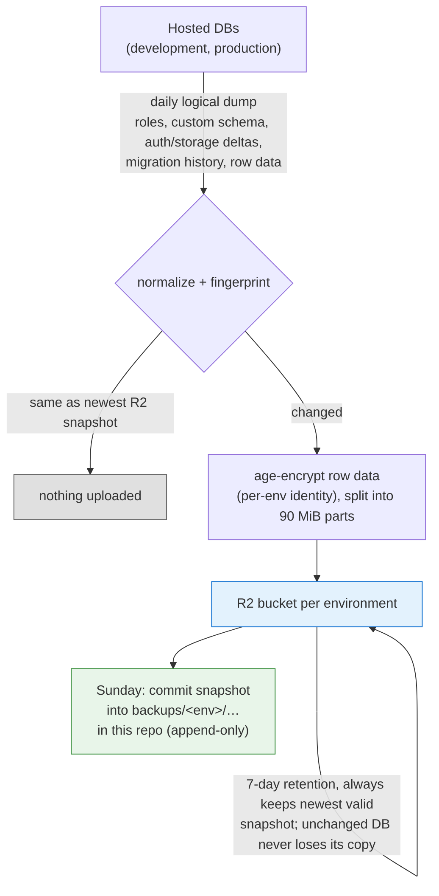
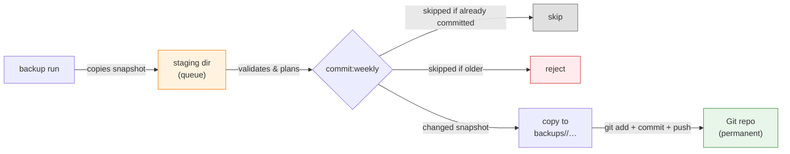

# Supabase DB (free) backup

Encrypted logical backups of the **development** and **production**
Supabase databases, stored in Cloudflare R2 (7-day rolling window) and in this
Git repository (permanent, dated), with verified restore commands.

> This backs up the _databases_, not the whole Supabase project: no Storage
> object bytes, Edge Functions, dashboard/Auth provider settings, API keys, or
> the Vault root key. See [Backup scope](#backup-scope).

---

## Rationale

Supabase **free tier** plan does not offer a backup solution. This repo tries to solve that problem,
by storing daily (for the last week) db snapshots in Cloudflare R2 and a weekly snapshot in this repo.

## Prerequisites

- **Node.js >= the release pinned in `.node-version`** (the preflight rejects older versions);
- **age** ([used for encryption](https://github.com/FiloSottile/age));
- **Docker** (Having Supabase installed from a docker image suffices);
- **`gh`** (**optional** - only for `github:configure` script).

## Usage

### Setup

1. Create a separate private GitHub repository from this source. (A public fork remains public and cannot run backups.)
2. Create `.env.production.local` and, if needed, `.env.development.local`; only production is mandatory. See [Configuration](#configuration).
3. Run `npm run doctor` and fix every reported problem until it exits `0`. The doctor validates every checked file's complete static contract (all supported variables above — `DECRYPT_KEY` is restore-only and only ever warned when absent — canonical shapes, relationships, private 0600 file permissions, no symlinks) and then runs read-only connectivity probes: Dockerized `psql` `SELECT 1` against each hosted database, R2 `HeadBucket`, an `age-keygen -y` key-pair derivation, and the selected local stack. Docker, a running local stack, `age-keygen`, and network access are mandatory. Missing `.env.production.local` fails; a missing development file is skipped and production then supplies the local-stack path. All static checks finish before any live call, failures from every category are aggregated into one names-only report, and legacy/duplicate/unknown assignments only warn. Never run the live doctor in CI: the ignored dotenv files and external credentials are intentionally absent there.
4. Set the required GitHub Actions variables and secrets (or use `github:configure` script). `github:configure` always runs the same doctor first in STATIC-ONLY mode (`--help` bypasses it) — file contracts and shapes, no Docker/network probes, so it works offline and in CI-like environments — and uploads only the exact in-memory values the doctor validated; it then inventories existing GitHub Environment secret names without reading values, upserts the approved variables/secrets, and finally deletes the legacy `SUPABASE_DB_URL` secret from each environment only after every environment completed all upserts (see [Supabase connection migration](#supabase-connection-migration)). As its final step it sets the repository-level `BACKUPS_ENABLED=true` opt-in, so a failed or partial run never enables backup jobs.

## Architecture

When the repository is private and `BACKUPS_ENABLED` is exactly `true`, GitHub Actions (`.github/workflows/backup.yml`) runs every day at **03:17 UTC**:



- **The dump is the change detector**: a dump is taken every day; unchanged
  databases upload nothing but retention still runs.
- At most **one completed snapshot per UTC date** per environment; a changed
  same-day snapshot replaces the previous one.
- Git snapshots are permanent and append-only; R2 is the fast/rolling copy,
  Git is the recovery of last resort.

## Core implementation

| Module (`src/`)                                      | Responsibility                                                                                                                                                                            |
| ---------------------------------------------------- | ----------------------------------------------------------------------------------------------------------------------------------------------------------------------------------------- |
| `config.js`                                          | dotenv + process env loading, validation (Shared Session Pooler URL, bucket/env match, legacy-variable gate)                                                                             |
| `database.js`                                        | Pinned Supabase CLI dump/diff, `supabase db reset` execution                                                                                                                              |
| `backup.js`                                          | Shared dump/package mechanics: executable preflight, private workspace, dump-then-package                                                                                                 |
| `snapshot.js`                                        | Snapshot packaging (encrypted or plaintext row-data codec) and the `manifest.json` written last (marks completion)                                                                        |
| `encryption.js`                                      | Row-data codecs: age (X25519) encryption of gzipped row data or plaintext, 90 MiB part splitting                                                                                          |
| `fingerprint.js`                                     | Deterministic hash over normalized logical SQL (the change detector)                                                                                                                      |
| `r2.js`                                              | S3 upload/list/delete against the per-environment R2 bucket                                                                                                                               |
| `repository.js`                                      | Reading/writing dated snapshot dirs in Git                                                                                                                                                |
| `restore.js`                                         | Shared verification: manifest schema, sizes, SHA-256, part order, codec-aware row-data restore (decryption only for age snapshots), aggregate fingerprint; sources: repo, R2, local store |
| `hosted-restore.js`                                  | Hosted restore: Dockerized psql client (pinned ephemeral image), reset target, apply verified snapshot in one transaction                                                                 |
| `local-stack.js`                                     | Read-only local-stack helpers: `SUPABASE_CONFIG_PATH` file validation (config path -> canonical project root, port, container) and the psql probe used by `backup:local`                                                                                 |
| `local-backup.js`                                    | Local store: private tree/lock, read-only stability guard, crash-durable publish-before-retention                                                                                         |
| `runtime.js`, `stream.js`, `process.js`, `logger.js` | Node runtime gate, streaming, subprocess, logging utilities                                                                                                                               |

## Backup scope

**Included:** custom roles (no passwords), application schema, custom
`auth`/`storage` changes (e.g. the `create_account_for_new_user` and
`cleanup_deleted_user_vouches` triggers, restored as a managed delta),
migration history, supported row data (incl. Auth/Storage metadata).

**Excluded:** Storage object bytes, Edge Functions, dashboard/Auth provider
settings and API keys, Vault/pgsodium root key, `storage.buckets_vectors` /
`storage.vector_indexes`, Realtime configuration outside captured SQL.

## Snapshot layout

```text
R2 bucket (development|production):
  snapshots/<YYYY-MM-DDTHH-mm-ssZ>/
    roles.sql,
    schema.sql,
    managed-schema.sql,
    migration-history-schema.sql
    data.sql.gz.age.part-000 …            # encrypted, ≤90 MiB parts
    manifest.json                         # sizes/SHA-256, env, project ref,
                                          # CLI+Postgres versions, age recipient,
                                          # aggregate content fingerprint

Git repository (backups/<environment>/):
  backups/<environment>/<YYYY-MM-DDTHH-mm-ssZ>/   # same files as above,
                                                  # no snapshots/ level
```

## Configuration

Ignored local files (never commit):

- `.env.development.local`,
- `.env.production.local`.

Configuration values (see [.env.example](.env.example)):

| Variable                                    | Purpose                                     | Notes                                                                                                                        |
| ------------------------------------------- | ------------------------------------------- | ---------------------------------------------------------------------------------------------------------------------------- |
| `BACKUPS_ENABLED`                           | GitHub Actions opt-in                       | repository-level Actions variable set to exactly `true` by `github:configure` as its final step; only exact `true` enables jobs; not consumed by local commands |
| `BACKUP_ENVIRONMENT`                        | `development` \| `production`               | must match target (development for env.development.local & production from env.production.local)                             |
| `SUPABASE_PROJECT_REF`                      | supabase project reference                  | the unique 20-character identifier for your Supabase project, shown as the last part of your dashboard URL (after /project/) |
| `SUPABASE_SHARED_POOLER_URL`                         | **Supabase Shared Session Pooler URL**     | copy the Session pooler value from Dashboard > Connect > Session pooler (`postgresql://postgres.<project-ref>:<password>@aws-<pool>-<region>.pooler.supabase.com:5432/postgres?sslmode=require`); direct `db.<...>.supabase.co` URLs and transaction-mode port `6543` are rejected; the legacy `SUPABASE_DB_URL` name is rejected |
| `CLOUDFLARE_ACCOUNT_ID`                     | Cloudflare account id                       |                                                                                                                              |
| `R2_BUCKET`                                 | R2 bucket                                   | must equal the environment (production \| development)                                                                       |
| `R2_ACCESS_KEY_ID` / `R2_SECRET_ACCESS_KEY` | R2 credentials (scoped to the bucket)       |                                                                                                                              |
| `ENCRYPT_KEY`                               | public age recipient (`age1…`)              | backup only (hosted); not consumed by any restore or local command                                                        |
| `DECRYPT_KEY`                               | private age identity (`AGE-SECRET-KEY-…`)   | r2/repo restores only (and legacy encrypted local snapshots); never uploaded                                                 |
| `SUPABASE_CONFIG_PATH`                  | exact main-project `supabase/config.toml` file                  | required by `backup:local`, `reset:local`, and the target side of `restore:local`; read from the local-stack (`development`) environment file; relative values resolve from this repository; the project root used as Supabase CLI cwd is derived from it; the legacy `PROJECT_WORKDIR` name is rejected |

To generate `ENCRYPT_KEY` and `DECRYPT_KEY` run `npm run generate-age-keys` to populate these fields inside .env files.

### Supabase config path migration

Local commands (`backup:local`, `reset:local`, and the target side of
`restore:local`) now require the main project's exact config file instead of
its directory. Breaking change:

```dotenv
# before
PROJECT_WORKDIR=../main-project
# after
SUPABASE_CONFIG_PATH=../main-project/supabase/config.toml
```

`SUPABASE_CONFIG_PATH` is validated as an existing regular file at
`<project>/supabase/config.toml` (never this repository's own config);
relative values resolve from this backup repository. A leftover
`PROJECT_WORKDIR` is rejected by those commands with
`UNSUPPORTED PROJECT_WORKDIR (rename to SUPABASE_CONFIG_PATH)` — there is no
grace period, fallback, or alias. The doctor accepts legacy, duplicate, and
unknown assignments as warnings only; a warning never satisfies a missing
current variable.

## Doctor

`npm run doctor` is a standalone local-configuration gate:

- static phase (no external call): reads `.env.production.local` (required)
  and `.env.development.local` (optional, skipped with a status line when
  absent) as 0600 regular files — symlinks and group/world-readable files are
  rejected — requires all supported variables in every checked file except
  the restore-only `DECRYPT_KEY` (missing it warns; present, it must match
  the recipient), enforces the canonical shapes (project ref, account ID,
  32/64 lowercase hex R2 credentials, matching X25519 age pair,
  `SUPABASE_CONFIG_PATH`), the environment/bucket/pooler relationships, and
  validates every `SUPABASE_CONFIG_PATH` with the real workdir validator.
  Values come only from the files: ambient process exports are ignored. Any
  static error in any file aborts before a single lookup, subprocess, Docker,
  database, or R2 call, and every static problem is reported together.
- live phase (strictly read-only, sequential): Dockerized `psql` 17
  `SELECT 1` per hosted environment (development first, then production),
  R2 `HeadBucket` via the exact validated credentials, an age key-pair
  derivation (`age-keygen -y`, identity over stdin, recipient never on
  argv), and one `SELECT 1`/`SHOW server_version_num` probe against the
  selected local stack. Hosted connection passwords travel in the docker
  client's environment (`-e PGPASSWORD`), never in the `docker run` argv.
  Development supplies the local-stack path when both files exist;
  otherwise production does. Missing Docker or `age-keygen` fail those
  probes while independent checks still run; deadline expiry stops all
  further probes with a stable timeout problem.
- output contract: every failure is stored as one allowlisted static problem
  (`<environment>: SUPABASE connection failed`, `R2 bucket access failed`,
  `age key-pair validation failed`, `local database connection failed`, …)
  and the raw error, stderr, and cause are discarded. Status and warnings use
  the same fixed labels; no value, URL, password, credential, age key, or
  configured path is ever printed, serialized, or kept as an error cause.
- `github:configure` runs the same doctor automatically before resolving `gh`
  in static-only mode (`live: false` — no Docker/network probes, so the
  setup command works offline and in CI-like environments; `--help` bypasses
  it) and uploads only the exact validated in-memory values. One overall
  deadline bounds the doctor and every GitHub call together.

`npm run doctor` exits `0` only when every checked file's static contract
and every live probe passed. A real run needs Docker, a running local stack,
`age-keygen`, and network access to both hosted databases and both R2
buckets; it belongs on the operator machine, not in CI, because the ignored
dotenv files and external credentials are intentionally absent there.

## Scripts

| Script                     | Runs                                                               | Purpose                                                                              |
| -------------------------- | ------------------------------------------------------------------ | ------------------------------------------------------------------------------------ |
| `npm run lint`             | `vp lint`                                                          | Oxlint with the migrated ESLint policy (`vite.config.ts` `lint.rules`)               |
| `npm run test`             | `node --test --test-skip-pattern=integration`                      | Native unit tests                                                                    |
| `npm run test:integration` | `node --test --test-name-pattern=integration --test-concurrency=1` | Serial Docker integration suite on disposable fixtures                               |
| `npm run check`            | `vp check` + unit tests                                            | Full package check. Note: bare `vp check` is only formatting + lint (Vite+ built-in) |
| `npm run preflight`        | `node --input-type=module -e "…assertNodeVersion()"`               | Runtime version gate (`.node-version` minimum)                                       |

**Formatting and environment:**

| Command             | Runs            | Purpose                                     |
| ------------------- | --------------- | ------------------------------------------- |
| `npm run fmt`       | Oxfmt           | Auto-format all files in the working tree   |
| `npm run fmt:check` | Oxfmt (dry-run) | Fail if any file is unformatted; used in CI |

**Backup and restore:**

| Script                                                                                                            | Purpose                                                                         |
| ----------------------------------------------------------------------------------------------------------------- | ------------------------------------------------------------------------------- |
| `npm run backup -- --environment development\|production`                                                         | Dump, fingerprint, upload changed snapshot to R2, run retention                 |
| `npm run backup:local`                                                                                        | Package the ALREADY-RUNNING local stack DB into `local-backups/local/`   |
| `npm run restore:development -- --source r2\|repo\|local --backup latest\|<snapshot-id>`                          | Restore into hosted development DB                                              |
| `npm run restore:production -- --source r2\|repo\|local --backup latest\|<snapshot-id>`                           | Restore into hosted production DB (maintenance window required)                 |
| `npm run reset:development` / `npm run reset:production`                                                                 | Wipe the hosted DB to empty (`supabase db reset --db-url`); typed confirmation required, production phrase names the project ref; nothing is restored afterwards |
| `npm run reset:local`                                                                                                    | Rebuild the ALREADY-RUNNING local workdir stack DB from its own migrations/seed (`supabase db reset --local`); pinned CLI, sibling-workdir checks, no hosted contact |
| `npm run restore:local -- --environment development\|production --source r2\|repo --backup latest\|<snapshot-id>` | Restore either hosted snapshot into the local `<workdir>` stack                 |
| `npm run doctor`                                                                                                | Validate every existing dotenv file (private perms, static contract + read-only hosted DB/R2/age/local-stack probes); aggregated names-only errors; exits 0 only when everything passes       |
| `npm run github:configure [OWNER/REPO]`                                                                           | Run the doctor in static-only mode, then sync GitHub Environments from the exact validated values                              |
| `npm run generate-age-keys`                                                                                       | Generate age X25519 key pair and write to existing `.env.*.local` files         |
| `npm run commit:weekly -- --staging-dir <path> --repo-root .`                                                     | Weekly Git snapshot commit (used by the workflow; runnable locally on `master`) |

- Restore targets are **cleaned first** (`supabase db reset` / volume
  recreation), then the verified snapshot applies in **one Dockerized psql
  transaction** streamed over stdin (`ON_ERROR_STOP=1`, `--single-transaction`)
  from the pinned ephemeral image; on failure the target rolls back and stays
  clean — retry from the same verified snapshot. The client container uses
  default bridge networking (no `--network=host`), keeps a read-only rootfs
  with a writable in-memory `/tmp`, and complete stdin delivery is part of
  command success: a source read failure terminates the client instead of
  letting a partial SQL prefix commit and be reported as restored.
- `reset:development|production` run the same clean step as restore but apply
  **nothing** afterwards — the hosted target is left empty. The repository
  workdir has no migrations/seeds, and the target is fixed by the
  per-environment `.env.<environment>.local` connection URL (never
  `supabase link` global state). `reset:local` instead rebuilds the local
  stack from the sibling project selected by `SUPABASE_CONFIG_PATH`'s own
  migrations/seed, with the
  explicit `--local` flag — never link state.
- `--backup` accepts `latest` or one exact canonical snapshot id
  (`YYYY-MM-DDTHH-mm-ssZ`); unavailable ids print the valid choices.
- Before any repo restore: `git pull --ff-only origin master`.
- Confirmation phrases (interactive TTY, no bypass): hosted development
  `RESTORE development`; hosted production `RESTORE production <project-ref>`;
  local-stack restore `RESTORE local`.
- `restore:local` reads a hosted snapshot (`--source r2|repo`, always
  decrypted with the age identity) into the local `<workdir>` stack. The
  snapshot environment selects only the SOURCE; the destructive target is
  always the config path from the local-stack (`development`) environment
  file (`SUPABASE_CONFIG_PATH`), whose derived project root becomes the
  Supabase CLI cwd. The stack is stopped with its DB volume
  deleted, bootstrapped fresh (`db start` only — services stay down), then
  the verified snapshot applies in **one psql transaction**
  (`ON_ERROR_STOP=1`, `--single-transaction`) that begins by atomically
  replacing the `public` schema; on failure the transaction rolls back and
  the freshly bootstrapped stack is left running with nothing applied —
  retry from the same verified snapshot. Managed auth/storage drift is
  checked against that fresh target before any data applies: non-empty
  snapshot data whose target relations/columns/sequences are missing fails
  closed, while empty incompatible blocks are skipped. The warning and the
  completion summary name the snapshot's origin project ref. The plaintext
  local store is never a source here: it only feeds hosted restores
  (`--source local`).

### Staging directory (`--staging-dir`)

The **staging directory is a queue, not a backup**: it holds snapshots that
are _pending_ the next weekly Git commit, before they are accepted into the
append-only `backups/<environment>/<snapshot-id>/` history. It is unrelated to
Git's index (nothing here is ever `git add`ed directly) and its contents are
ephemeral — the durable copies are R2 and the committed `backups/` tree.

```text
<staging-dir>/<environment>/<snapshot-id>/
  roles.sql, schema.sql, …, data.sql.gz.age.part-000, manifest.json
```



### Local backup (`backup:local`)

`npm run backup:local` (no arguments) packages the **already-running local
Supabase stack** owned by the sibling project into a private,
repository-local store. It reuses the exact dump, fingerprint,
gzip + plaintext part splitting, and manifest pipeline as the hosted backup,
but never encrypts (no age binary, no `ENCRYPT_KEY`), never touches R2, and
never starts, stops, resets, or migrates the local stack. It uses only
read-only connectivity and source-state probes. There is no environment
selection: the config identity is fixed to the `development` dotenv (where
`SUPABASE_PROJECT_REF` records the sibling project) and snapshots are always
labeled `local`.

`npm run reset:local` is the deliberate destructive counterpart (pinned CLI,
sibling-workdir checks, explicit `--local`, warning before the run — no typed
phrase: the stack is a reproducible developer database).

```text
local-backups/local/<YYYY-MM-DDTHH-mm-ssZ>/
  roles.sql
  schema.sql
  managed-schema.sql
  migration-history-schema.sql
  data.sql.gz.part-000 …      # plaintext (local-only) gzip parts, ≤90 MiB
  manifest.json               # written last; completion marker, declares
                              #   "encryption": { "format": "none" }
```

- One completed snapshot is retained in the single `local` store; there is no
  per-environment isolation because there is one local database.
- Existing snapshots under `local-backups/development/` and
  `local-backups/production/` from the pre-single-store layout are NOT
  deleted but are no longer restorable; reconcile/remove them manually.
- The six sequential logical dumps are bracketed by conservative, database-local
  state probes (tuple-mutation counters plus relation, sequence, and role digests).
  Any data, schema, role, or sequence change rejects the candidate before packaging
  or publication; quiesce local writes and retry.
- An **unchanged** database keeps the existing snapshot ID and path (same
  logical content and target project ref). A **changed** snapshot is fully
  validated, its files/directories are fsynced, and it is atomically renamed
  and parent-fsynced before older snapshots are removed. Retention is
  parent-fsynced again; unsupported fsync semantics fail closed before old
  snapshots are deleted. Completed snapshots are never overwritten.
- On POSIX, existing store/snapshot directories must already be mode `0700`
  and retained files mode `0600`. Every retained file is allowlisted by the
  manifest and size/SHA-256
  verified; plaintext row-data intermediates never survive the run.
- Do not commit `local-backups/` (gitignored). At rest, local snapshots are
  PLAINTEXT on disk (gzip row data only) — the tradeoff is deliberate: no
  age on this path. Confidentiality relies on the 0700 directory / 0600 file
  policy (POSIX) and the gitignore; a machine with read access to the repo
  dir can read local snapshots. The store is restorable via
  `restore:development|production --source local` (see below) and ready for a
  later, separately authorized upload flow — no upload command exists here.
- **Stale-lock recovery:** if a run is interrupted, the store lock
  `local-backups/.lock-local` may remain. Confirm no matching
  `backup:local` command is active, then remove the lock file and retry. Lock
  release verifies its ownership token/inode and reports cleanup failures.
  Interrupted canonical `.candidate-<16-hex>` directories are cleaned on the
  next run; noncanonical lookalikes are preserved for manual reconciliation.

### Restore a local backup to a hosted environment

`npm run restore:development|restore:production -- --source local --backup
latest|<snapshot-id>` restores a snapshot from `local-backups/local/`
into the hosted target database. Plaintext snapshots need **no decryption**:
no `DECRYPT_KEY`, no age binary, no R2 credentials. `DECRYPT_KEY` is
**optional** for `--source local` — it is only resolved when actually
configured (and then conflict-checked like any other consumed variable). A
pre-refactor age-encrypted snapshot still found in the store keeps working
when `DECRYPT_KEY` and the age binary are configured; if the age binary is
missing from PATH while `DECRYPT_KEY` is set, the restore fails fast during
preflight with the install hint. Hosted read-only preflight,
reset/apply pipeline, and confirmation phrases are unchanged (production still
requires `RESTORE production <project-ref>`).

## Supabase connection migration

All hosted backup/restore commands consume the **Shared Session Pooler** in
Session mode exclusively, under the single external contract
`SUPABASE_SHARED_POOLER_URL`:

- only `SUPABASE_SHARED_POOLER_URL` configures hosted operations; there is no
  fallback to the legacy `SUPABASE_DB_URL`;
- direct `db.<project-ref>.supabase.co` URLs, transaction-pooler forms, and
  port `6543` are rejected by config validation;
- any hosted operation facing the literal `SUPABASE_DB_URL` variable (in the
  dotenv file or the process environment) fails with a static
  `UNSUPPORTED SUPABASE_DB_URL (rename to SUPABASE_SHARED_POOLER_URL)` error,
  even when the new name is also present;
- local `backup:local` never consumes hosted URL fields.

The Shared Session Pooler exposes the IPv4 connectivity the default Docker
bridge requires for the Dockerized `psql` 17 restore client — direct project
hosts advertise IPv6, which the bridge cannot reach. Copy the Session pooler
value from [Supabase Dashboard → Connect → Session
pooler](https://supabase.com/docs/guides/database/connecting-to-postgres) and
set `sslmode=require` (or `verify-ca`/`verify-full`). Note that `require`
encrypts but does not authenticate the server; on untrusted networks prefer
`verify-full` (with the CA reachable by `psql`), which also validates the
server hostname.

Zero-downtime rollout for an existing deployment:

1. Rename the legacy variable in **every local dotenv file**
   (`.env.development.local`, `.env.production.local`):
   `SUPABASE_DB_URL` → `SUPABASE_SHARED_POOLER_URL`. Local runs fail with a
   static `UNSUPPORTED SUPABASE_DB_URL` error until the rename is done.
2. Pre-stage `SUPABASE_SHARED_POOLER_URL` as an Environment secret
   (development and production) while keeping `SUPABASE_DB_URL` in place:
   `gh secret set SUPABASE_SHARED_POOLER_URL --env <environment> --repo <owner/repo>`
   with the value on stdin.
3. Deploy the changed workflow (which consumes only
   `secrets.SUPABASE_SHARED_POOLER_URL`) to `master`.
4. Once the new workflow is active, run `npm run github:configure -- <owner/repo>`.
   It upserts every current value for every configured environment **before**
   deleting the legacy secret; deletion runs only where the pre-mutation
   inventory showed `SUPABASE_DB_URL` existed, so a rerun after partial
   deletion converges without attempting to delete absent secrets. A failed
   upsert leaves every legacy secret untouched. Only environment-scoped
   secrets are deleted; a repo-level `SUPABASE_DB_URL` secret (if any) must
   be removed manually: `gh secret delete SUPABASE_DB_URL --repo <owner/repo>`.
5. Verify by listing secret **names only**, never values:
   `gh secret list --env <environment> --repo <owner/repo>` must show
   `SUPABASE_SHARED_POOLER_URL` in both environments and no `SUPABASE_DB_URL`.

Deletion reference:
[GitHub CLI — deleting an environment secret](https://cli.github.com/manual/gh_secret_delete).

## References

- [Supabase automated backups (CLI)](https://supabase.com/docs/guides/backups/automated-backups)
- [Supabase CLI backup/restore guide](https://supabase.com/docs/guides/cli/managing-config)
- [Supabase local development backups](https://supabase.com/docs/guides/local-development/cli/local-backups)
- [Supabase — connecting to PostgreSQL (Session pooler)](https://supabase.com/docs/guides/database/connecting-to-postgres)
- [Cloudflare R2 S3 JavaScript SDK](https://developers.cloudflare.com/r2/examples/aws-sdk-js-v3/)
- [GitHub Actions — Scheduled workflows](https://docs.github.com/en/actions/reference/events-that-trigger-workflows#schedule)
- [GitHub CLI — `gh secret delete`](https://cli.github.com/manual/gh_secret_delete)
- [age encryption format](https://age-encryption.org/)
